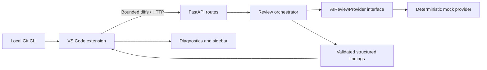

# Initial architecture

Git collection and backend transport are independent of the VS Code API and tested with
real subprocesses and HTTP. Pydantic is the server contract; Zod validates client responses.
The provider protocol separates orchestration from future model adapters. The current
orchestrator filters unchanged/deleted-only hunks, applies a score threshold, deduplicates
fingerprints and caps findings. The mock provider is intentionally narrow.

Upcoming stages add strict hunk normalization, real static-analysis signals and evidence
aggregation. Bedrock and PR sources will reuse the orchestrator. No repository filesystem
paths are resolved by the backend. The cloud deployment and storage adapters are not yet built.
